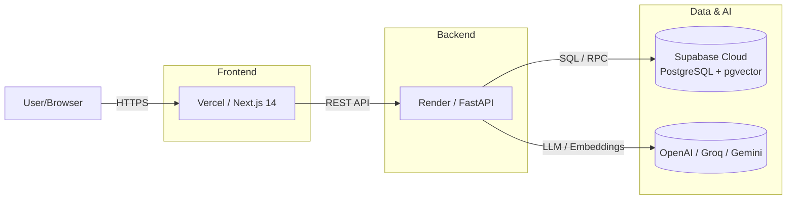

# AI StudyMate

AI-powered personalized learning platform. Upload study materials, ask questions grounded in your documents, generate quizzes with AI evaluation, plan your studies, and explore career paths.

## Architecture



### Components

| Layer | Technology | Responsibility |
|-------|-----------|----------------|
| Frontend | Next.js 14 + TypeScript + Tailwind + shadcn/ui | UI, auth flow, API client |
| Backend | FastAPI + Python 3.11 + Pydantic v2 | Auth, documents, tutor, quiz, planner, career APIs |
| Database | Supabase PostgreSQL + pgvector | Users, profiles, documents, chunks, chats, quizzes, plans, career recs |
| Auth | Supabase Auth (email/password) | JWT-based session management |
| Storage | Supabase Storage | PDF file storage |
| AI | OpenAI GPT-4o / Groq / Gemini | Chat completions, embeddings, quiz generation, evaluation, planner, career analysis |

## Features

### P0 — Core Learning Flow
- **Authentication**: Signup, login, logout with Supabase Auth
- **Dashboard**: Greeting, stats, quick-access cards
- **Document Upload**: PDF upload with type/size validation, async processing
- **RAG Tutor**: AI chat grounded in uploaded documents with citations
- **Quiz Generation**: AI-generated multiple-choice quizzes with evaluation

### P1 — Personalization
- **Study Planner**: AI-generated study plans with daily tasks and completion tracking
- **Career Assistant**: Role recommendations, skill gap analysis, learning paths
- **Progress Analytics**: Quiz history, average scores, recent activity

## Local Setup

### Prerequisites

- Node.js 18+
- Python 3.11+
- Supabase CLI (`npx supabase`)
- OpenAI API key (or Groq / Gemini)

### 1. Clone and install

```bash
git clone <repo-url>
cd ai-studymate
```

### 2. Start Supabase

```bash
npx supabase start
npx supabase db push
```

Create the `documents` storage bucket in Supabase Dashboard → Storage.

### 3. Backend

```bash
cd apps/api
python -m venv .venv
source .venv/bin/activate  # Windows: .venv\Scripts\activate
pip install -r requirements.txt
cp .env.example .env
# Edit .env with your Supabase and AI credentials
uvicorn app.main:app --reload --port 8000
```

### 4. Frontend

```bash
cd apps/web
npm install
cp .env.example .env.local
# Edit .env.local with your Supabase and API URL
npm run dev
```

Open http://localhost:3000

## Environment Variables

### Frontend (`apps/web/.env.local`)

| Variable | Description |
|----------|-------------|
| `NEXT_PUBLIC_SUPABASE_URL` | Supabase project URL |
| `NEXT_PUBLIC_SUPABASE_ANON_KEY` | Supabase anon/publishable key |
| `NEXT_PUBLIC_API_URL` | Backend API URL (default: `http://localhost:8000`) |

### Backend (`apps/api/.env`)

| Variable | Description |
|----------|-------------|
| `SUPABASE_URL` | Supabase project URL |
| `SUPABASE_ANON_KEY` | Supabase anon key (for auth operations) |
| `SUPABASE_SERVICE_ROLE_KEY` | Supabase service role key (server-only) |
| `SUPABASE_JWT_SECRET` | Supabase JWT secret for token verification |
| `OPENAI_API_KEY` | OpenAI API key |
| `GROQ_API_KEY` | Groq API key (optional fallback) |
| `GEMINI_API_KEY` | Gemini API key (optional fallback) |

**Never commit `.env` files.** They are gitignored.

## Supabase Migrations

Migrations are in `supabase/migrations/`. Apply with:

```bash
npx supabase db push
```

Current migrations:
1. `001_create_profiles_and_rls.sql` — profiles table
2. `002_create_documents_and_rls.sql` — documents table
3. `003_create_document_chunks_and_rls.sql` — document chunks with pgvector
4. `004_create_tutor_tables_and_rls.sql` — tutor chats
5. `005_create_tutor_messages_and_rls.sql` — tutor messages
6. `006_create_quiz_tables_and_rls.sql` — quizzes, questions, attempts, evaluations
7. `007_vector_search_function.sql` — RAG similarity search RPC
8. `008_vector_index.sql` — HNSW index on embeddings
9. `009_create_study_planner_and_rls.sql` — study plans and tasks
10. `010_create_career_and_rls.sql` — career recommendations

### Required Storage Bucket

Create a bucket named `documents` in Supabase Dashboard → Storage.

## Production Deployment

| Component | Platform | Notes |
|-----------|----------|-------|
| Frontend | Vercel | Native Next.js support |
| Backend | Render | Python with uvicorn |
| Database | Supabase Cloud | Includes pgvector and Storage |

### Deployment Steps

1. Create Supabase cloud project, run migrations, enable pgvector
2. Deploy backend to Render with environment variables
3. Deploy frontend to Vercel with `NEXT_PUBLIC_API_URL` pointing to Render backend
4. Verify end-to-end flow

## Demo Flow

See `DEMO_RUNBOOK.md` for step-by-step demonstration instructions.

## Scripts

### Backend

```bash
cd apps/api
uvicorn app.main:app --reload --port 8000  # Start server
pytest                                       # Run tests
```

### Frontend

```bash
cd apps/web
npm run dev      # Start dev server
npm run lint     # Lint
npm run build    # Production build
```

## Project Structure

```
apps/
├── web/                    # Next.js frontend
│   ├── app/                # App Router pages
│   ├── components/         # React components
│   ├── lib/                # API client, Supabase clients
│   └── shared/             # Shared TypeScript types
├── api/                    # FastAPI backend
│   ├── app/
│   │   ├── api/routes/     # API endpoints
│   │   ├── domain/         # Business logic (tutor, quiz, planner, career)
│   │   ├── core/           # Config, Supabase clients, logging
│   │   └── middleware/     # Auth middleware
│   └── tests/              # pytest tests
└── shared/                 # Shared error types
supabase/
├── migrations/             # SQL migrations
└── README.md               # Supabase setup docs
```

## License

Hackathon project — AI StudyMate.
